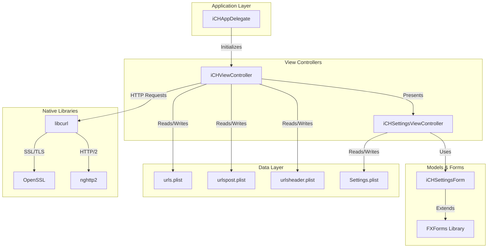
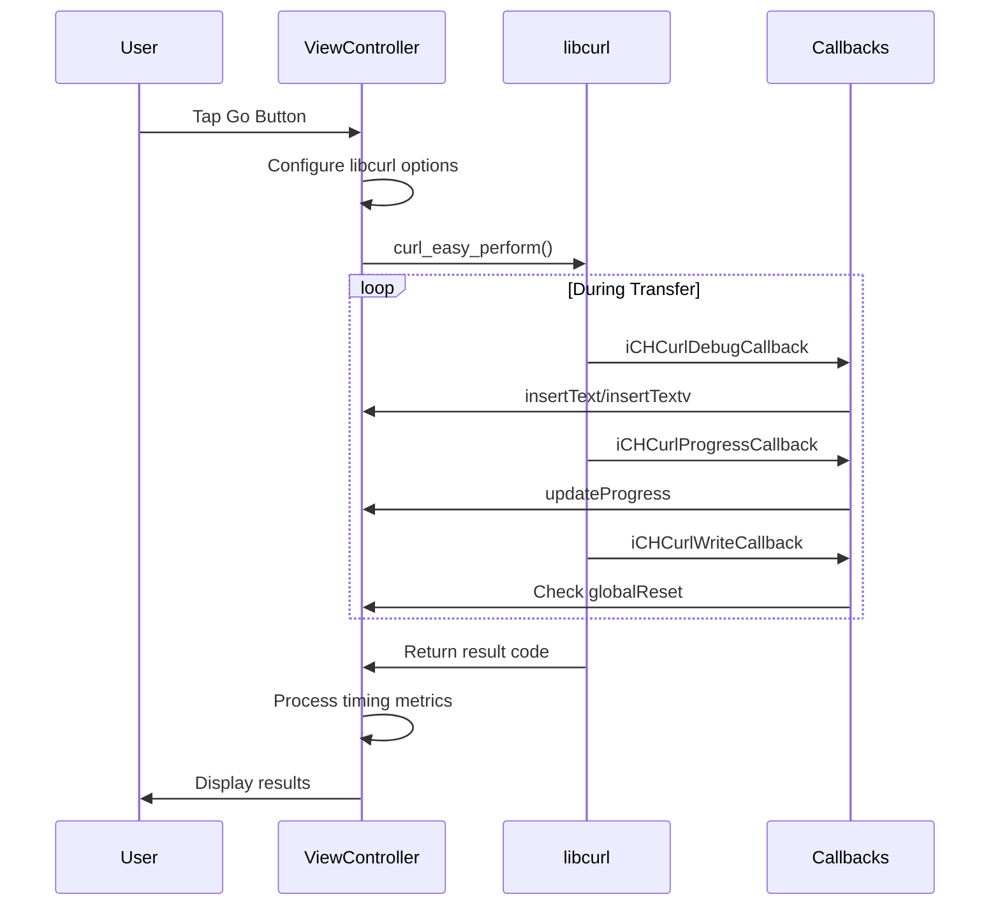
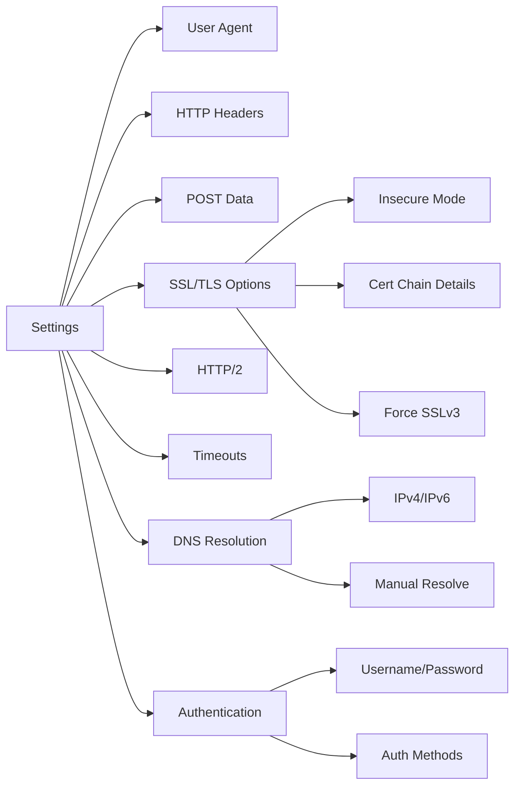
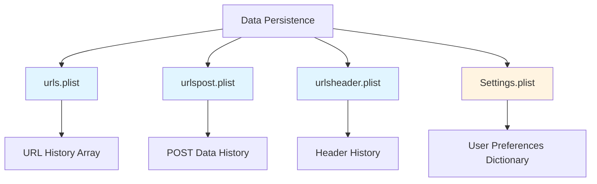
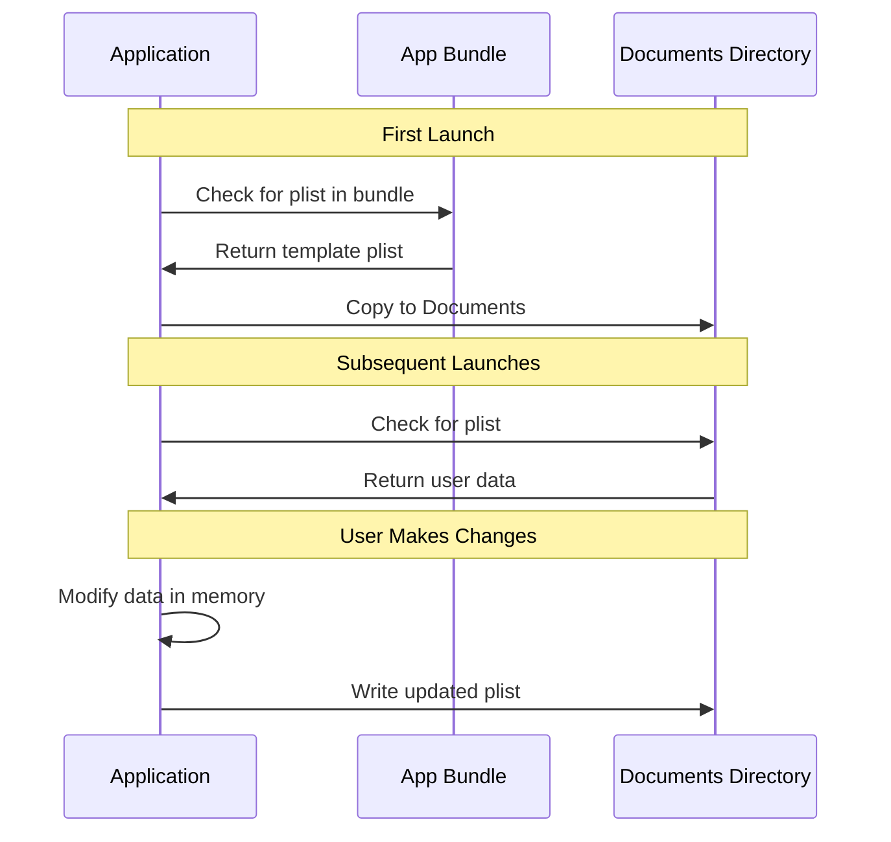
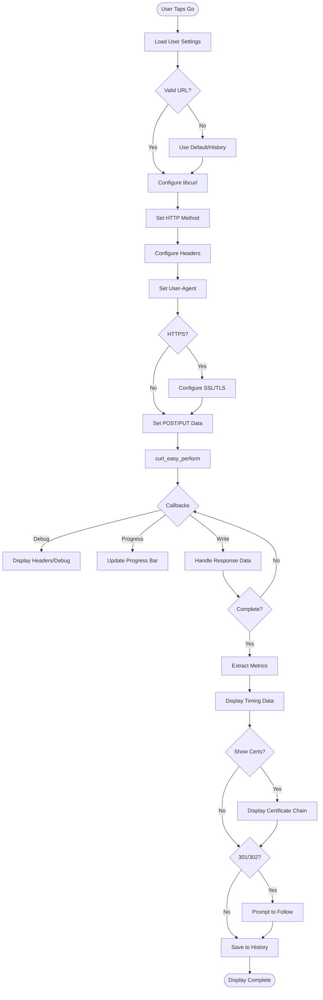
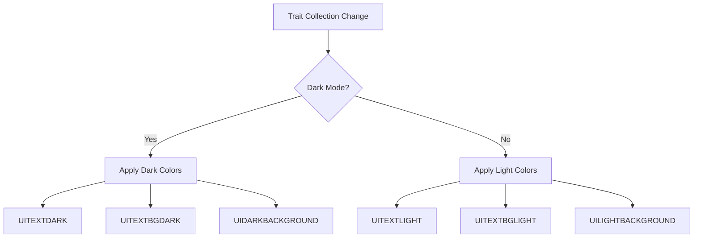
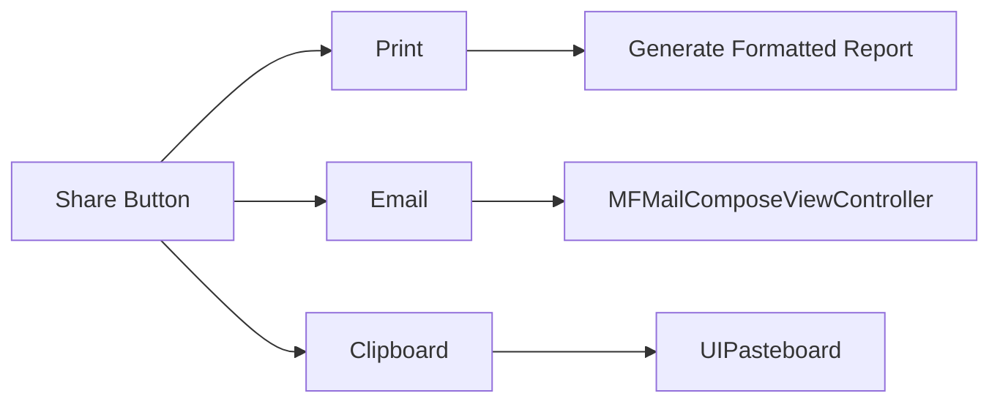

# iCurlHTTP - Architecture Design Document

## Overview

iCurlHTTP is an iOS application that provides HTTP server response diagnostics similar to cURL. It allows users to execute HTTP requests (GET, HEAD, POST, PUT, DELETE, OPTIONS, TRACE) against web servers and view detailed response information including headers, SSL/TLS details, timing metrics, and certificate chains.

**Current Version:** v1.17  
**Platform:** iOS (iPhone, iPad, Mac Catalyst)  
**Primary Language:** Objective-C  
**Key Dependencies:** libcurl, OpenSSL, nghttp2, FXForms

---

## Application Architecture

### Architecture Pattern

The application follows a **Model-View-Controller (MVC)** pattern with some procedural elements:

- **Model:** Data persistence via Property Lists (`.plist` files)
- **View:** XIB files for UI layout (device-specific)
- **Controller:** View controllers managing UI and business logic



---

## Core Components

### 1. Application Delegate (`iCHAppDelegate`)

**File:** `iCHAppDelegate.h/m`

**Responsibilities:**
- Application lifecycle management
- Device detection and appropriate NIB selection
- libcurl and OpenSSL initialization
- Platform-specific initialization (iPhone, iPad, Mac Catalyst)

**Key Logic:**
```objectivec
- Device detection based on screen dimensions
- Support for notched iPhones (X, XR, 11, 12, 13 series)
- iOS version compatibility checks
- OpenSSL and libcurl global initialization
```

---

### 2. Main View Controller (`iCHViewController`)

**Files:** `iCHViewController.h/m`

**Responsibilities:**
- Primary UI management
- HTTP request execution via libcurl
- Result display and formatting
- URL history management
- Progress tracking and user feedback

**Key Properties:**

| Property | Type | Purpose |
|----------|------|---------|
| `_urlText` | UITextField | URL input field |
| `_resultText` | UITextView | Response output display |
| `_httpReq` | UISegmentedControl | HTTP method selector |
| `_browserType` | UISegmentedControl | User-Agent selector |
| `_verbose` | UISegmentedControl | Output mode toggle |
| `_progress` | UIProgressView | Download progress indicator |
| `_curl` | CURL* | libcurl handle |
| `favoriteURLs` | NSMutableArray | URL history |
| `favoritePOST` | NSMutableArray | POST data history |
| `favoriteHEADER` | NSMutableArray | Header history |

**Key Methods:**

```objectivec
- (IBAction)Go:(id)sender              // Execute HTTP request
- (IBAction)DropDown:(id)sender        // Show URL history
- (IBAction)Share:(id)sender           // Share/export results
- (IBAction)User:(id)sender            // Open settings
- (IBAction)Reset:(id)sender           // Reset/cancel request
- (void)initLibcurl                    // Initialize libcurl
- (void)loadSettings                   // Load user settings
- (void)saveSettings                   // Persist settings
```

**libcurl Integration:**

The view controller manages libcurl through callback functions:



**Callback Functions:**

| Function | Purpose |
|----------|---------|
| `iCHCurlDebugCallback` | Captures verbose debug output (headers, data) |
| `iCHCurlWriteCallback` | Handles response body data |
| `iCHCurlProgressCallback` | Reports download progress |
| `iCHCurlIoctlCallback` | Handles data rewind for retries |
| `iCHCurlReadCallback` | Provides upload data (POST/PUT) |

---

### 3. Settings Controller (`iCHSettingsViewController`)

**Files:** `iCHSettingsViewController.h/m`

**Responsibilities:**
- Settings form presentation
- User preference persistence
- Integration with FXForms library

**Key Features:**
- Modal presentation
- Form-based settings using FXForms
- Settings.plist management

---

### 4. Settings Form Model (`iCHSettingsForm`)

**Files:** `iCHSettingsForm.h/m`

**Responsibilities:**
- Settings data model conforming to `FXForm` protocol
- Field definitions and layout
- Form validation

**Settings Categories:**



**Settings Properties:**

| Property | Type | Purpose |
|----------|------|---------|
| `userAgent` | NSString | Custom User-Agent string |
| `userHeaders` | NSString | Additional HTTP headers |
| `userPost` | NSString | POST data payload |
| `userInsecure` | BOOL | Skip SSL verification |
| `userSSLv3` | BOOL | Force SSLv3 protocol |
| `userCertDetail` | BOOL | Show certificate chain |
| `userHTTP2` | BOOL | Enable HTTP/2 support |
| `userTimeout` | NSNumber | Request timeout (seconds) |
| `userConnectTimeout` | NSNumber | Connection timeout (seconds) |
| `userIPv4/userIPv6` | BOOL | IP version preferences |
| `userResolve` | NSString | Manual DNS resolution |
| `userName/userPass` | NSString | Authentication credentials |
| `userAuth*` | BOOL | Authentication method flags |

---

### 5. Utility Extensions

#### `iCHColors.h`

**Purpose:** Centralized color definitions for light/dark mode support

**Key Definitions:**
- Light mode colors (`UITEXTLIGHT`, `UITEXTBGLIGHT`)
- Dark mode colors (`UITEXTDARK`, `UITEXTBGDARK`)
- Border and status colors

#### `iCHSegmentedOverride.h`

**Purpose:** UISegmentedControl category for iOS 13+ styling

**Features:**
- Custom text color handling for iOS 13+
- Maintains consistent appearance across iOS versions

#### `iCHStringTrunc.h`

**Purpose:** NSString category for text truncation

**Features:**
- Truncate strings to fit width with ellipsis
- Font-aware sizing

---

## Data Persistence

### Property List Files

The application uses `.plist` files stored in the Documents directory:



### Data Flow



---

## Network Architecture

### libcurl Configuration

The application configures libcurl with extensive options:

**Base Configuration:**
```objectivec
CURLOPT_HTTPAUTH        → CURLAUTH_BASIC
CURLOPT_NOSIGNAL        → 0L
CURLOPT_VERBOSE         → 1L
CURLOPT_CAINFO          → cacert.pem path
CURLOPT_TIMEOUT         → User configurable (default: 60s)
CURLOPT_CONNECTTIMEOUT  → User configurable (default: 10s)
```

**SSL/TLS Configuration:**
```objectivec
CURLOPT_SSLVERSION      → CURL_SSLVERSION_DEFAULT or SSLv3
CURLOPT_SSL_CIPHER_LIST → "ALL" (permits all cipher suites)
CURLOPT_CERTINFO        → 1L (collect certificate chain)
CURLOPT_SSL_VERIFYPEER  → Conditional (based on userInsecure)
```

**HTTP/2 Configuration:**
```objectivec
CURLOPT_HTTP_VERSION → CURL_HTTP_VERSION_2_0 (if userHTTP2 enabled)
```

### Request Flow



---

## User Interface

### Device-Specific Views

The application uses different XIB files based on device:

| Device Type | XIB File | Notes |
|-------------|----------|-------|
| iPhone (standard) | `iCHViewController_iPhone_port.xib` | iPhone 6/7/8, SE |
| iPhone (notched) | `iCHViewController_iPhoneX_port.xib` | iPhone X and newer |
| iPad | `iCHViewController_iPad_port.xib` | All iPad models |
| Mac Catalyst | `iCHViewController_Mac.xib` | macOS version |

**Device Detection Logic:**
```objectivec
Screen Height (native pixels):
  2436, 1624, 1792, 2688, 2778, 2532, 2340 → Notched iPhone
  < 2436 → Standard iPhone
  iPad → Use iPad layout
```

### Dark Mode Support

iOS 13+ dark mode support:



---

## Threading Model

### Concurrency Approach

The application uses a simple threading model:

1. **Main Thread:** UI operations, user interaction
2. **Background Thread:** HTTP requests (implicit in libcurl callbacks)
3. **Synchronization:** `globalReset` flag for cancellation

**Global Reset States:**
- `0` - Idle, ready for new request
- `1` - Request in progress
- `2` - Cancellation requested

**Thread Safety Mechanisms:**
```objectivec
waitForUser flag → Blocks download thread during user dialogs
globalReset flag → Signals cancellation to libcurl callbacks
Main run loop pumping → Ensures UI updates during long operations
```

---

## Feature Capabilities

### HTTP Methods Supported

| Method | iPhone | iPad |
|--------|--------|------|
| GET | ✓ | ✓ |
| HEAD | ✓ | ✓ |
| POST | ✓ | ✓ |
| PUT | ✓ (newer models) | ✓ |
| DELETE | - | ✓ |
| OPTIONS | - | ✓ |
| TRACE | - | ✓ |

### Browser Emulation

User-Agent presets for:
- cURL (default)
- iPhone Safari
- iPad Safari
- Chrome
- Firefox (iPad)
- Internet Explorer

### Output Modes

1. **Basic Mode:** Clean response output
2. **Detail Mode:** Verbose headers, timing, SSL details

### Share Capabilities



---

## External Dependencies

### libcurl (v7.80.0)

**Purpose:** HTTP/HTTPS request handling

**Configuration:**
- Custom callbacks for debugging
- Progress tracking
- SSL certificate handling
- HTTP/2 support via nghttp2

**Include Path:** `include/curl/`

### OpenSSL (v1.1.1l)

**Purpose:** SSL/TLS encryption and certificate handling

**Features Used:**
- Certificate verification
- Certificate chain inspection
- Multiple cipher suite support
- SSLv3/TLS protocol selection

**Include Path:** `include/openssl/`

### nghttp2 (v1.46.0)

**Purpose:** HTTP/2 protocol support

**Integration:** Compiled into libcurl

### FXForms (v1.2 beta)

**Purpose:** Dynamic form generation for settings

**Features Used:**
- Declarative form definitions
- Automatic UITableView population
- Field type handling (text, boolean, integer)
- Section headers/footers

**Files:** `FXForms/FXForms.h/m`

---

## Build Configuration

### Project Structure

```
iCurlHTTP.xcodeproj/
├── project.pbxproj          # Xcode project configuration
└── xcuserdata/              # User-specific settings

include/                      # C library headers
├── curl/                    # libcurl headers
└── openssl/                 # OpenSSL headers

libs/                        # iOS device libraries
libs_catalyst/               # Mac Catalyst libraries

iCurlHTTP/                   # Application source
├── *.h, *.m                 # Implementation files
├── *.xib                    # Interface files
├── *.plist                  # Data files
└── Images.xcassets/         # Image resources
```

### Compiler Settings

**Language:** Objective-C  
**Deployment Target:** iOS 9.0+ (based on code patterns)  
**Architectures:** arm64, arm64e (iOS), x86_64 (Catalyst)

---

## Next Steps & Areas for Improvement

### High Priority

1. **Code Modernization**
   - Migrate to Swift for better type safety and modern syntax
   - Replace manual memory management with ARC (if not already enabled)
   - Adopt Swift Concurrency (async/await) for network operations
   
2. **Architecture Improvements**
   - Separate network logic into dedicated service layer
   - Implement MVVM pattern for better testability
   - Create reusable networking component
   
   ```mermaid
   graph TD
       A[View Controller] --> B[View Model]
       B --> C[HTTP Service]
       C --> D[libcurl Wrapper]
   ```

3. **Threading Enhancement**
   - Replace `globalReset` flag with modern cancellation tokens
   - Use Grand Central Dispatch (GCD) or Operation Queues
   - Implement proper async/await pattern

4. **User Interface**
   - Consolidate XIB files using Auto Layout and size classes
   - Migrate to SwiftUI for modern declarative UI
   - Improve iPad multitasking support

### Medium Priority

5. **Feature Additions**
   - **Search/Filter:** Add search functionality for response text (regex support)
   - **Formatted Output:** JSON/XML syntax highlighting and pretty-printing
   - **Request Collections:** Save and organize multiple request configurations
   - **Export Formats:** Support exporting to HAR, Postman, or cURL command
   - **HTTP/3 Support:** Integrate QUIC protocol when libcurl supports it
   - **WebSocket Support:** Add WebSocket debugging capabilities
   
6. **Testing**
   - Add unit tests for network logic
   - Implement UI tests for critical workflows
   - Mock libcurl for testing without network
   
7. **Settings Enhancement**
   - Multiple profiles/workspaces
   - Import/export settings
   - Request templates
   - Environment variables support

8. **Response Handling**
   - Image preview for image responses
   - HTML rendering option
   - Binary data visualization (hex viewer)
   - Response diff comparison

### Low Priority

9. **Code Quality**
   - Remove deprecated API usage (UIAlertView references in comments)
   - Extract magic numbers to constants
   - Improve error handling and user feedback
   - Add code documentation (HeaderDoc/Jazzy)

10. **Performance**
    - Lazy loading for large responses
    - Streaming for large downloads
    - Background download support
    - Response caching options

11. **Accessibility**
    - VoiceOver support improvements
    - Dynamic Type support
    - Accessibility labels for all controls

12. **Security**
    - Keychain storage for credentials
    - Certificate pinning option
    - Secure storage for sensitive data

### Technical Debt

13. **Legacy Code**
    - Remove commented-out code (UIAlertView, old iOS version checks)
    - Consolidate duplicate XIB files
    - Update deprecated OpenSSL API usage (if any remain)

14. **Build System**
    - Update library versions (libcurl, OpenSSL, nghttp2)
    - Consider Swift Package Manager for dependencies
    - Add SwiftLint or similar linting tools

15. **Documentation**
    - Add inline code documentation
    - Create user manual
    - Document libcurl configuration patterns
    - API documentation for public methods

---

## Version History Summary

| Version | Release Date | Key Features |
|---------|--------------|--------------|
| v1.0 | 2/15/2013 | Initial release |
| v1.1 | 3/25/2013 | OpenSSL integration, SSL cert info |
| v1.2 | 9/5/2013 | iOS 7, timing details |
| v1.3 | 6/15/2014 | Share feature, user settings |
| v1.4 | 2/19/2015 | iPhone POST, history, iOS 8 |
| v1.5 | 2/6/2016 | Redirect following, Chrome UA |
| v1.6 | 9/5/2016 | HTTP/2, cert chain, IPv4/IPv6 |
| v1.7 | 10/15/2016 | DNS resolve, iPhone 7 |
| v1.8 | 10/31/2016 | Performance fixes |
| v1.9 | 12/23/2016 | iOS 9 compatibility |
| v1.10 | 11/11/2017 | HTTP/2 fixes |
| v1.11 | 4/21/2018 | iPhone X, iOS 12 |
| v1.12 | 4/4/2019 | OpenSSL 1.1.1 |
| v1.13 | 1/1/2020 | Dark mode, iOS 13 |
| v1.14 | 9/12/2020 | iPhone PUT support |
| v1.15 | 12/29/2020 | iPhone 12 support |
| v1.16 | 1/2/2021 | Mac Catalyst |
| v1.17 | 11/21/2021 | iPhone 13, latest libraries |

---

## Conclusion

iCurlHTTP is a well-established iOS application with a long history of updates and improvements. The architecture follows classic iOS MVC patterns with direct integration to native C libraries (libcurl, OpenSSL). While the codebase is mature and functional, there are significant opportunities for modernization including Swift migration, architectural refactoring, and enhanced testing coverage.

The application demonstrates good practices in:
- Multi-device support
- Persistent data management
- Dark mode adaptation
- Native library integration

Areas requiring attention include threading model modernization, UI consolidation, and code modernization to leverage recent iOS platform capabilities.
